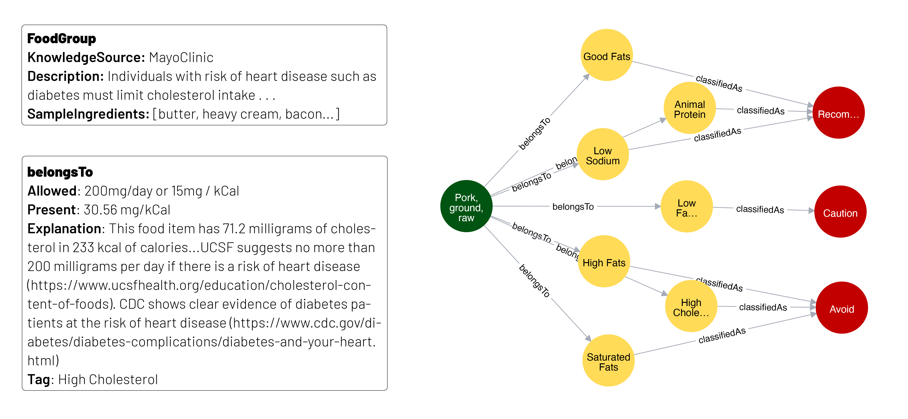
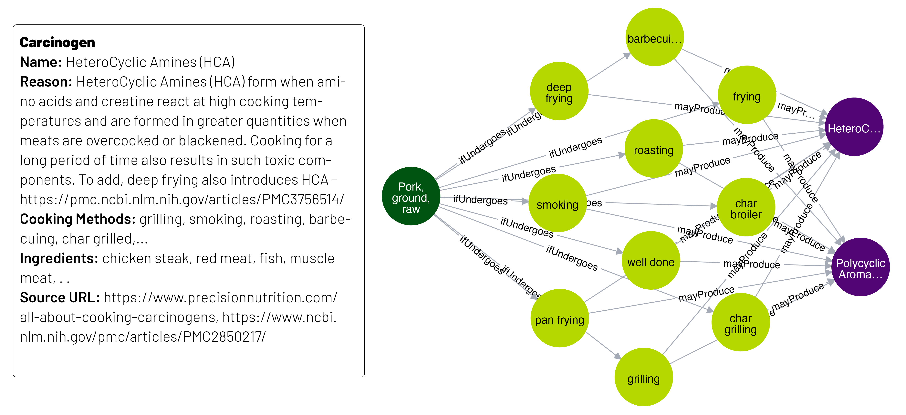
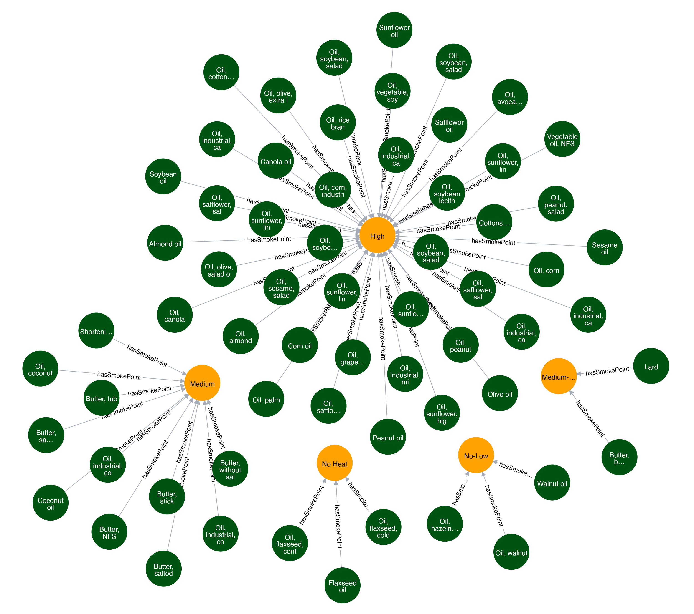
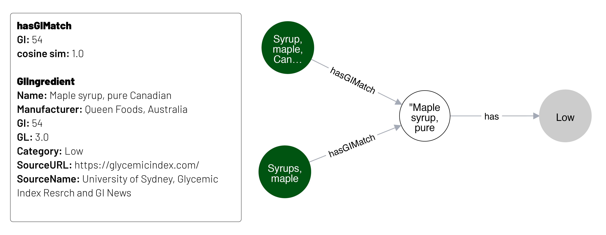

## Disease-specific Food Knowledge Graph
This repository consists of code and data to construct Disease-specific Food Knowledge Graph (DFKG). Specifically, the knowledge graph consists of reasoning for ingredinents in the context of diabetes that tells the reasons to have or avoid this particular ingredient. The KG also has additional components such as cooking taxonomy which helps in cooking method subsitutions, glycemic index of the ingredients and smoking point of fats and oils to determine the suitability of ingredients. Further, the KG also consists of causes that leads to the effect of carcinogen productions (eg: grillin + pork --> polyaromatic hydrocarbons). Each of the following KGs can be used individually or can be integrated into one KG.

### Diabetes Reasoning Knowledge Graph
Diabetes-specific Food Groups and example items were compiled from MayoClinic and NIDDK, as shown in Table below.Determining whether an ingredient belongs to a specific food group was not straightforward in certain cases. For instance, vegetables, fruits, nuts, and legumes are categorized as healthy carbohydrates, which aligns with the USFDA's categories. However, identifying whole grains requires calculating the carbohydrate-to-fiber ratio. To ensure accurate classification, expert-defined rules were gathered from multiple sources, as outlined in Table below. Each ingredient undergoes the checks for each food group. Ingredients may belong to multiple food groups. The decision label of avoid, recommend or caution for each food group is determined based on guidelines from MayoClinic and NIDDK.

| Food Group              | Rules                                                                                               |
|-------------------------|-----------------------------------------------------------------------------------------------------|
| **Healthy Carbohydrates** | Vegetables, Fruits, Nuts, Legumes, and Whole Grain                                                 |
| **Whole Grain Food**     | If carbohydrate:fibre ratio is 10:1 or greater for a grain, then it is a whole-grain food           |
| **Fibre-rich Food**      | If carbohydrate:fibre ratio is 10:1 or greater, then it is a fiber food                             |
| **Heart Healthy Items**  | If polyunsaturated fat, monounsaturated fat, or omega-3 is present, then it is a heart healthy item |
| **Good Fats**            | Avocado, Nuts, Olive oil, canola oil, peanut oil                                                  |
| **Protein**              | Eggs, Fish, Chicken without skin, Turkey without skin   less than 10% - low protein; between 10% and 35% medium protein; above 35% high protein   1g protein = 4 kcal |
| **Low Fat / Non-Fat**    | High: more than 17.5g; medium: 3 to 17.5g; low: less than 3g, fat-free: less than 0.5g. All per 100g |
| **Saturated Fat**        | 10% of calories from saturated fat is allowed. 1g fat = 9 kcal                                      |
| **Trans Fat**            | 2.2 grams per day in 2000 kcal or 0.9% of calories from trans fat allowed                          |
| **Cholesterol**          | 200 milligrams per day or 15 milligrams per 100 kcal                                               |
| **Sodium**               | 2300mg per day or < 1.1 mg/kcal = 2,300 mg at 2,100 kcal is allowed                               |
| **Added Sugar**          | Less than 10% of calorie percentage is allowed. (1g of carb = 4 kcal)                             |
| **Refined Carbohydrate** | If 10g carbohydrate:≥1g dietary fiber & ≤2g free sugars per 1g dietary fiber, then good carbohydrate. Else, refined carbohydrate |
| **Ultra Processed**      | Hot dogs, Fried fish sticks, Fast food burgers                                                     |
| **Deep Fried**           | Potato fries, Chicken nuggets, and ingredients with keyword "deep fry"                             |

 
The Diabetes Reasoning Knowledge Graph looks as follows where diabetes dietary classification of ingredient Pork from USFDA database is shown

  <figure style='display: table'>
  
  

  

</figure>

 
 

### Cooking Taxonomy
Cooking methods significantly impact the nutrition of food. For instance, boiling reduces Vitamin C by up to 70%, deep frying introduces trans fats, which should be avoided for diabetes, and grilling meat produces carcinogenic compounds. Additionally, poultry must be cooked at specific temperatures to ensure safety, as heat kills pathogens.

To account for nutritional modifications, cooking methods and descriptions were gathered from Wikidata. A taxonomical classification was created based on cooking method types. Each method is classified as heat, mechanical, or chemical, with heat-based methods further divided into dry heat, liquid-based, and fat-based. Liquid is further split into water, milk, and other, while fat-based is divided into small, medium, and high fat. For example, deep frying falls under Heat $\rightarrow$ Fat-based $\rightarrow$ High fat $\rightarrow$ Deep frying, which can be substituted by a method like sautéing (small fat). Substitutions must be within the same cooking type (e.g., boiling cannot replace deep frying).

 
 

### Carcinogen Causal Knowledge Graph
Carcinogenic compounds, such as polycyclic aromatic hydrocarbons (PAHs), heterocyclic amines (HCAs), and advanced glycation end products (AGEs), can be produced during cooking at high temperatures. PAHs are formed when fat and juices from meat drip onto hot surfaces, causing smoke that contains these harmful compounds to adhere to the food. HCAs are generated when meat is cooked at high temperatures, especially through grilling or frying, leading to chemical reactions between amino acids and creatine in muscle tissue. AGEs are produced when food is exposed to heat, particularly in dry-heat cooking methods like roasting or frying, where sugars and proteins react to form these toxic compounds. These compounds are linked to increased cancer risk and other chronic health issues. Therefore, the ingredients and cooking methods responsible for carcinogen formation are identified and integrated into DFKG.

  <figure style='display: table'>
  
  
 Carcinogen Causal Knowledge Graph that captures the formation of carcinogens when certain cooking methods interact with certain ingredients. A sample of additional information stored as properties is also displayed
  

</figure>

 
 

### Smoking Point
Heating fats and oils beyond its designated smoking points can produce free radicals which are toxic compounds. Frequent consumption can lead to health concerns and therefore smoking points of fats and oils are also added to the knowledge base as shown in Figure below. 

  <figure style='display: table'>
  
  
 Smoking point of ingredients categories as no heat, no-low heat, medium heat, medium-high heat and high heat while preserving the actual smoke point with source information
  

</figure>

 
 

### Glycemic Index
The Glycemic Index (GI) measures how quickly carbohydrate-containing foods raise blood glucose levels. Foods with a high GI cause rapid spikes in blood sugar, which can be problematic for individuals with diabetes, as they struggle to regulate blood glucose levels. A lower GI diet, which includes foods that raise blood sugar more gradually, is often recommended for people with diabetes to help manage blood sugar levels and reduce the risk of complications. Choosing low-GI foods, such as whole grains, legumes, and non-starchy vegetables, can be beneficial for maintaining better glucose control. The Glycemic Index Database from the Sydney University Glycemic Index Research Service was collected with 4270 ingredients along with Glycemic Load (GL). Based on the GI value, they are classified as high (above 70), medium (56 to 69) or low (1 to 55) as per the guidelines from MayoClinic  and a graph is constructed as shown in Figure below.

  <figure style='display: table'>
  
  
 Mapping of ingredients from Glycemic index database to USFDA database
  

</figure>

 
 

### Steps to Run
All the above mentioned knowledge graphs are integrated into one big knowledge graph named Disease-specific Food Knowledge Graph. To stand up this KG, please follow the steps below:
* Navigate the `LoadNeo4j` folder and follow the steps to load the graph with existing data
* Steps to create the graph from scratch will be added soon